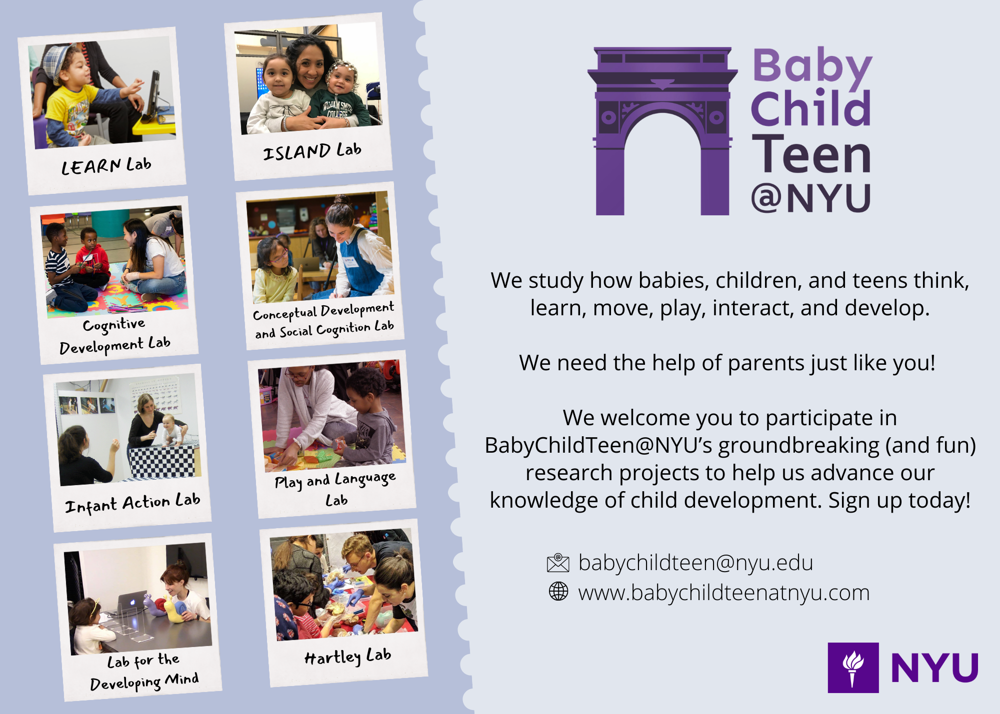
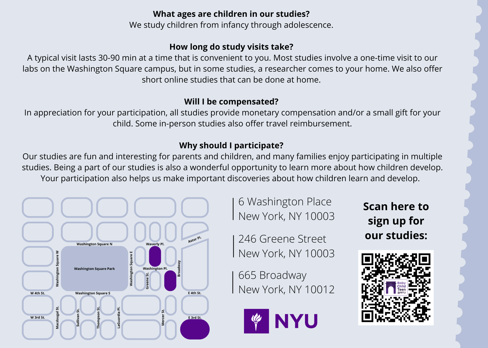
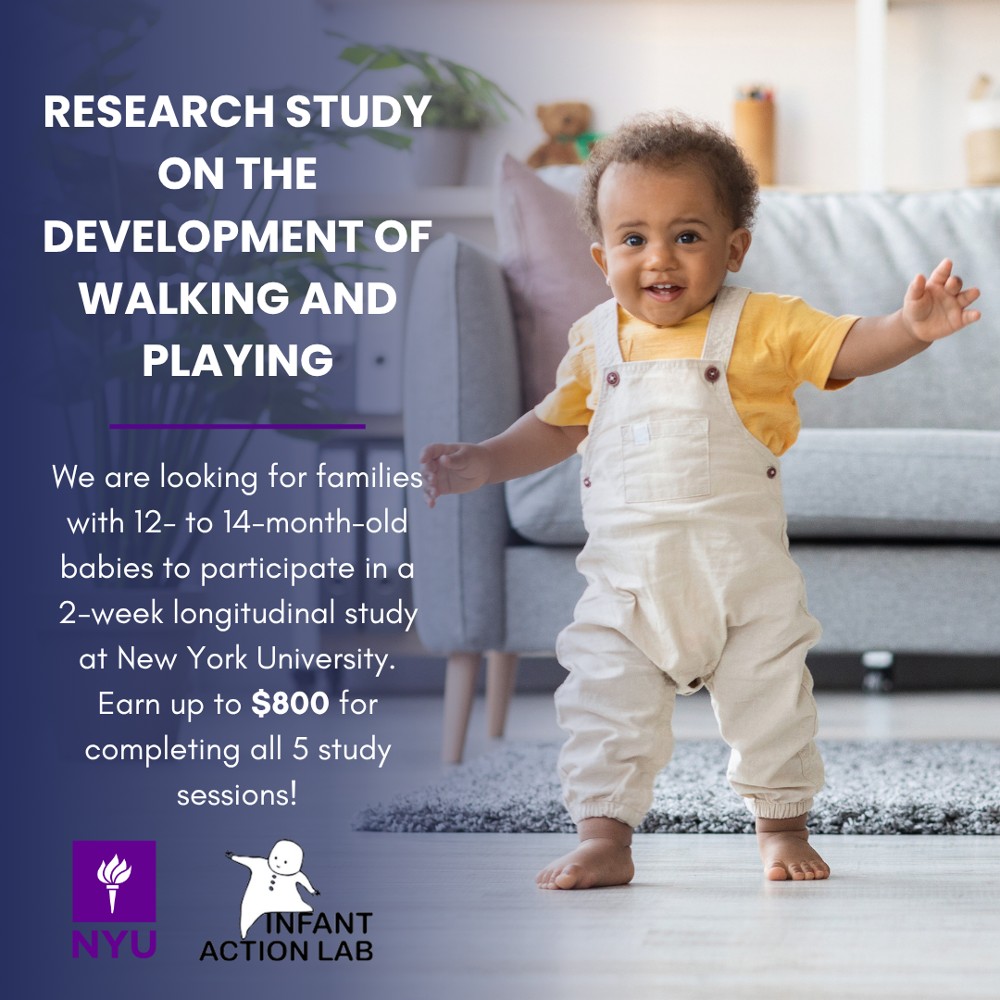
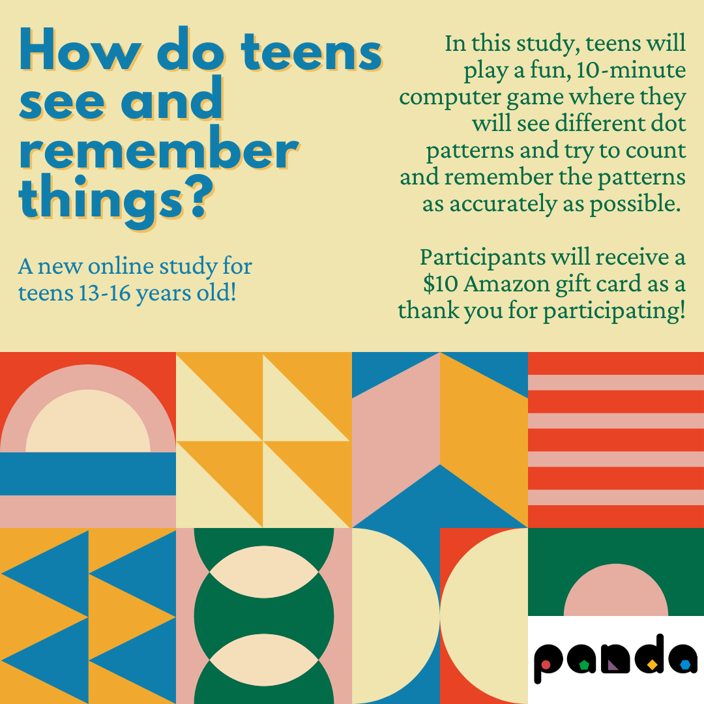
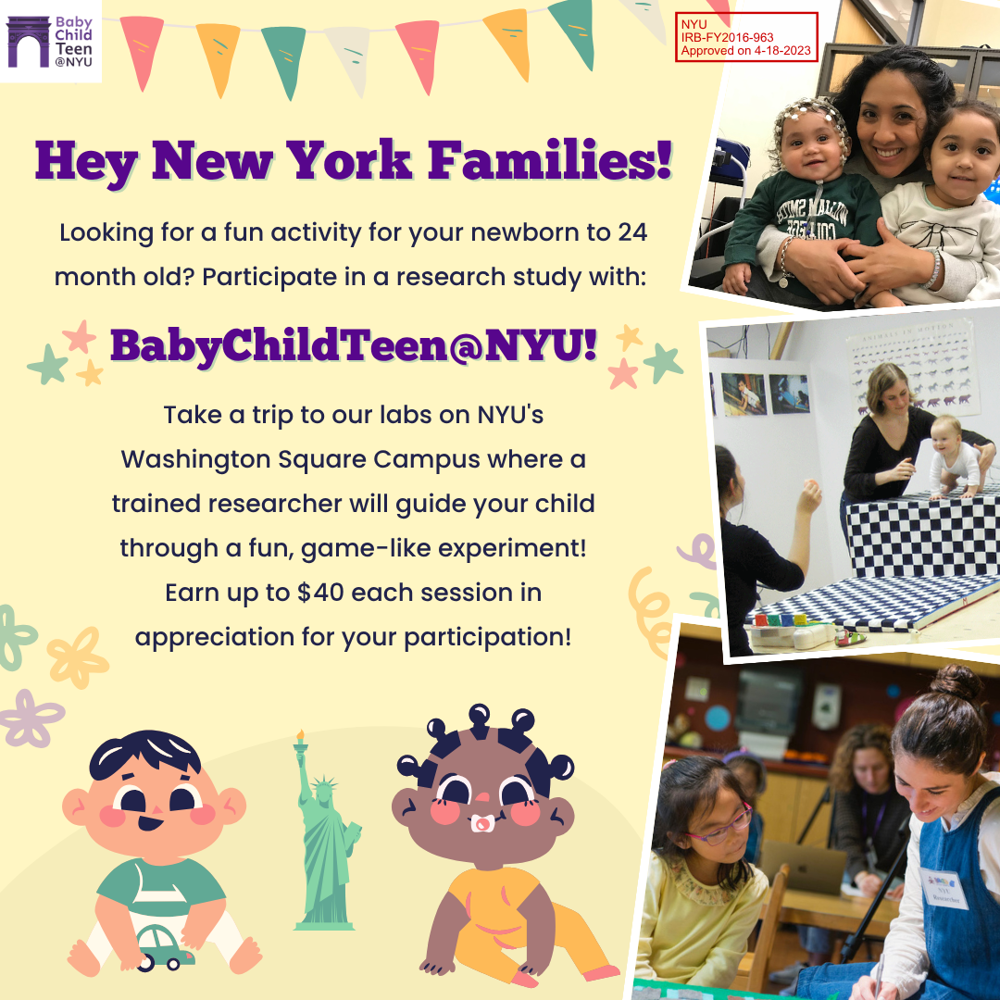
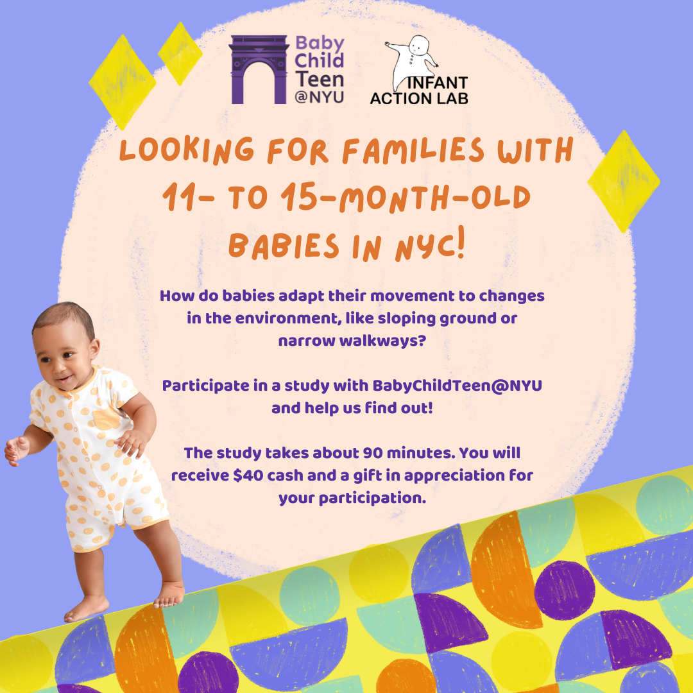
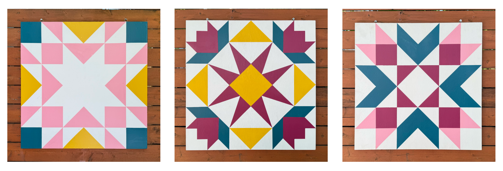

```{=html}
<style>
#TOC {
  background-image: url("assets/jl.png");
  background-size:70%;
  background-position: center 1rem;
  padding-top: 200px !important;
  background-repeat: no-repeat;
}
</style>
```

This page is a collection of projects I've worked on that are more design focused. Some of them are personal projects, while others are pieces of larger professional and academic work.

## Advertising Graphics

In my role with BabyChildTeen\@NYU I have designed a number of graphics for advertising our research studies and programming. These include social media ad graphics, print flyers, and more. The audience for these materials are parents of children of all ages, so I try to make the graphics visually engaging while also communicating the necessary information clearly. I have used a variety of tools for these projects, including Adobe Illustrator and Canva.

I also lead the end-to-end development of a new cloud-based recruitment system for BabyChildTeen\@NYU backed by a PostgreSQL database. The technical side of this work— a full-stack web application with custom UI/UX, user permissions, and a relational database— lives on its own project page. If you're interested in that kind of stuff, [take a look →](../product_dev/product_dev.html)

```{=html}
<div id="adcarousel" class="carousel slide" data-bs-ride="carousel">
  <ol class="carousel-indicators">
    <li data-bs-target="#adcarousel" data-bs-slide-to="0" class="active"></li>
    <li data-bs-target="#adcarousel" data-bs-slide-to="1"></li>
    <li data-bs-target="#adcarousel" data-bs-slide-to="2"></li>
    <li data-bs-target="#adcarousel" data-bs-slide-to="3"></li>
    <li data-bs-target="#adcarousel" data-bs-slide-to="4"></li>
    <li data-bs-target="#adcarousel" data-bs-slide-to="5"></li>
    <li data-bs-target="#adcarousel" data-bs-slide-to="6"></li>
    <li data-bs-target="#adcarousel" data-bs-slide-to="7"></li>
    <li data-bs-target="#adcarousel" data-bs-slide-to="8"></li>
    <li data-bs-target="#adcarousel" data-bs-slide-to="9"></li>
    <li data-bs-target="#adcarousel" data-bs-slide-to="10"></li>
  </ol>
  <div class="carousel-inner">
    <div class="carousel-item active">
      
    </div>
    <div class="carousel-item">
      
    </div>
    <div class="carousel-item">
      
    </div>
    <div class="carousel-item">
      
    </div>
    <div class="carousel-item">
      
        </div>
    <div class="carousel-item">
      
    </div>
    <div class="carousel-item">
      
    </div>
     <div class="carousel-item">
      
    </div>
     <div class="carousel-item">
      
    </div>
    <div class="carousel-item">
      
    </div>
    <div class="carousel-item">
      
    </div>
  </div>
  <a class="carousel-control-prev" data-bs-target="#adcarousel" role="button" data-bs-slide="prev">
    <span class="carousel-control-prev-icon" aria-hidden="true"></span>
    <span class="sr-only"></span>
  </a>
  <a class="carousel-control-next" data-bs-target="#adcarousel" role="button" data-bs-slide="next">
    <span class="carousel-control-next-icon" aria-hidden="true"></span>
    <span class="sr-only"></span>
  </a>
</div>
```

## Web Design

My first experience with web design was learning HTML to personalize my Tumblr blog in middle school. While I have no plans to share that (embarrassing), I have continued to develop my web design skills in various projects, including building this website hosted on Github Pages. I typically use a combination of R Quarto, HTML, CSS, R Shiny, and JavaScript. I also have built sites using WordPress and Squarespace.

Eventually, I'd love to build interactive, scrollable web-based visualization for data storytelling in the style of [The Pudding](https://pudding.cool/) and the [New York Times](https://www.nytimes.com/interactive/2025/12/22/us/2025-year-in-graphics.html). I am currently learning Svelte and D3.js, and I hope to be able to feature projects using those tools here soon.

```{=html}
<div class="browser-preview">
  <div class="browser-preview__bar">
    <div class="browser-preview__dots" aria-hidden="true">
      <span></span>
      <span></span>
      <span></span>
    </div>
    <div class="browser-preview__address">babychildteenatnyu.com</div>
  </div>
  <div class="browser-preview__viewport">
    
  </div>
</div>
<p class="browser-preview__caption">A preview of the BabyChildTeen@NYU website built on Squarespace.</p>
```

## Crafty Projects

#### Barn Quilts

Lately, I’ve been really into fiber arts and folk motifs. This spring, after spending a lot of time working in my garden, I wanted to create something of my own to beautify the not-so-attractive fence around my yard. I decided to paint a series of barn quilts with a shared color scheme. They add a great pop of color to the space, and I love the homey feeling they bring to my urban garden.

{fig-alt="Three painted barn quilt designs next to each other" style="margin-bottom: 0; margin-top: 0;"}

The project also felt like a way of connecting to my grandfather, a photographer and director who found joy later in life in creating vibrant geometric paintings. I loved those paintings as a kid, and I still remember the excitement of watching him pull away the blue painter’s tape to reveal the crisp lines underneath.

{style="display: block; margin-top: 0; margin-left: auto; margin-right: auto;" fig-alt="Jess and her family at her grandfather's art show." width="368"}
