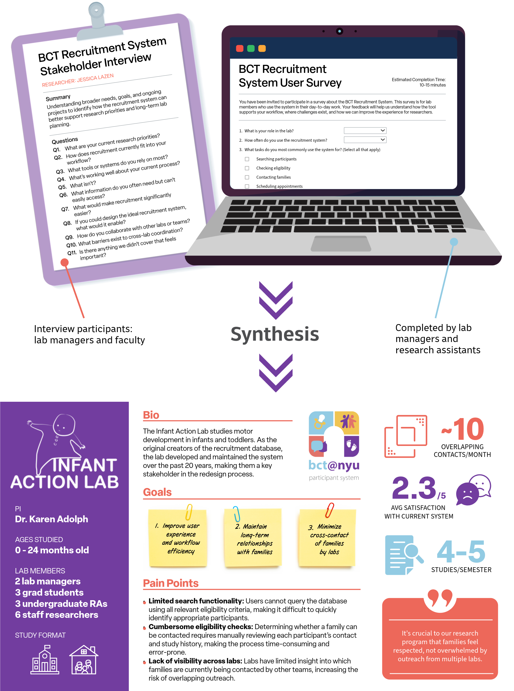

```{=html}
<style>
#TOC {
  background-color: var(--portfolio-surface);
  background-image: url("assets/logo.png");
  background-size: 75%;
  background-position: center 1rem;
  padding-top: 200px !important;
  background-repeat: no-repeat;
}

main.content > section.level1 > h1 {
  margin: 2.5rem 0 1.25rem;
  padding: 0.8rem 1rem 0.9rem;
  border: 1px solid var(--portfolio-line);
  border-radius: 16px;
  background: linear-gradient(135deg, #eef4f5 0%, #f5efe8 100%);
  box-shadow: var(--portfolio-shadow);
  font-size: 2rem;
  font-weight: 700;
  letter-spacing: -0.02em;
  line-height: 1.1;
}
</style>
```

## Background

BabyChildTeen\@NYU is a consortium of developmental psychology labs at NYU studying cognitive and social development across infancy, childhood, and adolescence. Recruiting participants for this kind of research is logistically complex. Families must be contacted repeatedly over months or years as children age into eligibility for new studies, and coordination across labs is essential to avoid over-contacting the same families or losing track of participation history.

For nearly two decades, the BCT relied on a recruitment database originally built by a single lab that grew into a shared system used by seven labs with fundamentally different workflows. It was never designed for this scale, and the strain showed: routine tasks required manual cross-checking, new staff needed extensive training, and a central administrator was needed to manage access and prevent conflicts.

This project was a ground-up redesign— not just of the database, but of the entire participant management workflow— with the goal of building something that could serve all labs reliably, securely, and at scale. I led this work as UX Research and Product Development Lead, drawing on my prior experience administering the legacy system and collaborating closely with faculty, lab managers, research assistants, and IT specialists to rebuild it.

```{=html}
<div class="portfolio-jump-callout">
  <p class="portfolio-jump-callout__label">This project touched a lot of ground— jump to what's most relevant to you:</p>
  <div class="portfolio-jump-callout__links">
    <a href="#ux-research-design">UX Research &amp; Design</a>
    <a href="#data-systems">Data &amp; Systems</a>
    <a href="#engineering-infrastructure">Engineering &amp; Infrastructure</a>
  </div>
</div>
```

# UX Research & Design

## Methods & Tools

-   Stakeholder interviews (faculty, lab managers, research assistants)
-   Survey design and administration (Qualtrics)
-   Think-aloud contextual inquiry sessions
-   User flow analysis and legacy system audit
-   Lab persona synthesis
-   Training material and onboarding documentation review


## Research Goals

-   **Improve UX:** Intuitive, easy-to-use interface for staff.

-   **Streamline recruitment:** Reduce administrative burden and inefficiencies.

-   **Coordinate assignments:** Avoid over-contact and maximize engagement.

-   **Enhance data quality:** Standardize records for easy management and search.

-   **Secure participant data:** Log user activity and implement access controls.

## Research & Discovery

### Lab Profiles

#### **Context**

Each of the 8 labs in BabyChildTeen\@NYU consists of a faculty member overseeing a team of graduate students, research staff, and undergraduate research assistants. While all labs rely on the shared recruitment system, they differ in research focus, study volume, recruitment frequency, and day-to-day workflows—resulting in distinct needs and constraints across teams.

#### **Methods**

I conducted **in-person interviews** with all 8 faculty to understand their research programs and long-term goals. I also interviewed lab managers, who directly oversee and train research assistants, and collected data from lab members via a **Qualtrics survey** to capture broader staff perspectives.

#### **Objective**

Synthesize insights from interviews and survey data into comprehensive lab profiles to guide system design and support user needs.

{fig-alt="Top: Illustration of faculty interview guide and lab user survey used to gather feedback on recruitment workflows and system needs. Bottom: Sample lab persona illustrating goals, pain points, and key metrics to inform the participant database redesign."}

### User Flow Analysis

#### **Context**

BabyChildTeen\@NYU relies on a legacy recruitment database originally built over 20 years ago by a single lab. At the time, the system was not designed for online research or cross-lab use. Over time, it was adopted by multiple labs with very different study formats, recruitment volumes, and workflows. As a result, labs now use the same system in fundamentally different ways, requiring significant oversight from a central administrator to coordinate access and prevent conflicts.

Online-focused labs primarily conduct large-scale email outreach to families nationwide, while in-person labs rely on long-term relationships with local families and conduct most recruitment via phone calls. These divergent workflows place increasing strain on a system that was never designed to support multiple recruitment models simultaneously. New staff require extensive training to navigate the system, and even experienced users rely on memory and manual cross-checking to complete routine tasks.

#### **Methods**

I conducted **think-aloud contextual inquiry sessions** with lab managers and research staff as they completed recruitment tasks in the system. Participants verbalized their thought process while searching for participants, checking eligibility, contacting families, scheduling appointments, and closing out studies.

To complement live observation, I reviewed existing training materials and onboarding documentation to understand how new staff are taught to use the system—and where informal knowledge fills gaps. These combined methods allowed me to capture both *intended* workflows and *actual* day-to-day practices, including workarounds and edge cases.

#### **Objective**

My goal was to surface mismatches between the system’s original design assumptions and current lab needs, identify high-friction moments, and uncover opportunities to support both in-person and remote research workflows. These insights informed the redesign strategy and ensured it served *all* labs—not just the original system owners.

{.lightbox fig-alt="A detailed flowchart showing the legacy BabyChildTeen@NYU recruitment system user flow."}

# Data & Systems

## Methods & Tools 

-   Relational database design (PostgreSQL)
-   Data pipeline development and maintenance
-   Schema modeling for multi-user production use
-   Data governance and access control protocols
-   Automated reporting infrastructure

# Engineering & Infrastructure

## Methods & Tools

-   R Shiny web application development
-   AWS infrastructure (EC2, RDS, Secrets Manager, CloudWatch)
-   HTTPS configuration (ACM certificate, Application Load Balancer)
-   Docker containerization via ShinyProxy
-   SSO integration (NYU Microsoft Entra ID / OIDC)

------------------------------------------------------------------------

Please note this project documentation is a work in project. Last updated 5/22/2026.
